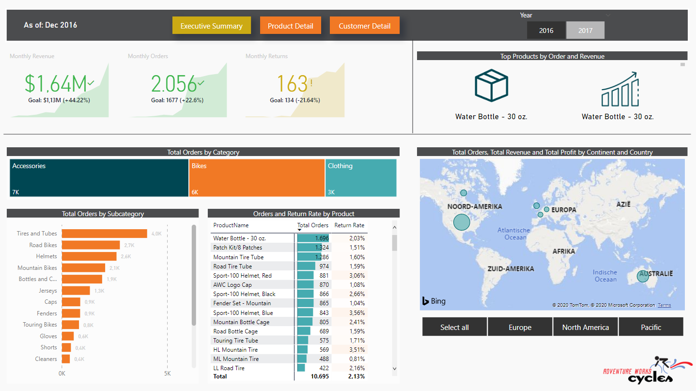

## ADVENTURE WORKS POWER BI SALES REPORT Demand

In preparation for my DA-100 exam, I retook the Power BI course from Maven Analytics on Udemy. Less than a year ago, I created a dynamic dashboard in Excel. In comparison to some of the formulas I wrote then to make the dashboard perform the way I needed it, I can say that Power BI and Dax are an absolute delight. 

  - Created a Sales Report in Power BI giving detailed insights on best-selling products and customers
  - Imported data from Excel and used Power Query to transform the data
  - Created a data model in Power BI and used DAX to create calculated columns and measures
  - Improved user experience by applying conditional formatting, drillthrough filters and visual interactions

